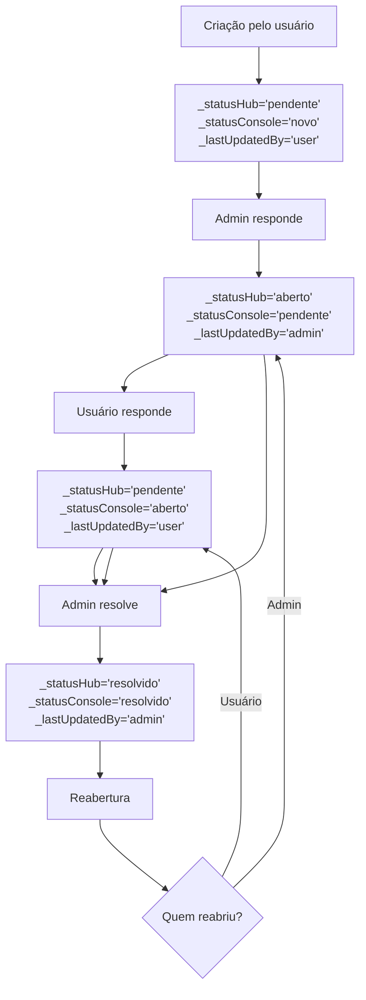

# Sistema de Tickets - Status e Endpoints
<!-- VERSION: v1.1.0 | DATE: 2025-01-30 | AUTHOR: VeloHub Development Team -->

## 📋 Visão Geral do Sistema

O sistema de tickets do VeloHub utiliza **duas coleções MongoDB** para gerenciar diferentes tipos de solicitações:

- **`console_chamados.tk_conteudos`** - Tickets de conteúdo (artigos, processos, roteiros, treinamentos, funcionalidades, recursos)
- **`console_chamados.tk_gestão`** - Tickets de gestão (gestão, RH e financeiro, facilities)

## 💬 Sistema de Histórico de Mensagens

### Estrutura do Campo _corpo

O campo `_corpo` foi alterado de `String` para `Array` de objetos para suportar histórico completo de mensagens:

```javascript
_corpo: [
  {
    autor: String,      // "user" | "admin"
    userName: String,   // Nome obtido do SSO
    timestamp: Date,    // Data/hora da mensagem
    mensagem: String    // Conteúdo da mensagem
  }
]
```

### Vantagens da Nova Estrutura

- **Histórico Completo**: Todas as mensagens são preservadas
- **Rastreabilidade**: Identificação clara do autor e timestamp
- **Escalabilidade**: Suporte a conversas longas
- **Retrocompatibilidade**: Conversão automática de strings existentes

## 🔄 Sistema de Status Dual

### Campos de Status

Cada ticket possui **3 campos de controle de status**:

| Campo | Descrição | Valores Permitidos |
|-------|-----------|-------------------|
| `_statusHub` | Status visível para o usuário | `novo`, `aberto`, `pendente`, `resolvido` |
| `_statusConsole` | Status visível para o gestor/admin | `novo`, `aberto`, `pendente`, `resolvido` |
| `_lastUpdatedBy` | Quem fez a última atualização | `user`, `admin` |

### Transições de Status



### Cenários de Status

| Cenário | _statusHub | _statusConsole | _lastUpdatedBy | Descrição |
|---------|------------|----------------|----------------|-----------|
| **Criação** | `pendente` | `novo` | `user` | Usuário criou o ticket |
| **Admin responde** | `aberto` | `pendente` | `admin` | Admin respondeu, usuário vê como aberto |
| **Usuário responde** | `pendente` | `aberto` | `user` | Usuário respondeu, admin vê como aberto |
| **Resolução** | `resolvido` | `resolvido` | `admin` | Ticket resolvido por admin |
| **Reabertura** | `pendente`/`aberto` | `pendente`/`aberto` | `user`/`admin` | Depende de quem reabriu |

## 🛠️ Endpoints da API

### CREATE - Criar Tickets

#### POST `/api/support/tk-conteudos`
Cria tickets de conteúdo (artigos, processos, roteiros, treinamentos, funcionalidades, recursos).

**Body:**
```json
{
  "_genero": "Artigo",
  "_tipo": "assunto_selecionado",
  "_corpo": "descrição_do_conteúdo",
  "_obs": "observações_adicionais",
  "_userEmail": "usuario@email.com"
}
```

**Resposta:**
```json
{
  "success": true,
  "ticketId": "TKC-000001"
}
```

#### POST `/api/support/tk-gestao`
Cria tickets de gestão (gestão, RH e financeiro, facilities).

**Body:**
```json
{
  "_genero": "Gestão",
  "_tipo": "tipo_selecionado",
  "_direcionamento": "direcionamento_selecionado",
  "_corpo": "mensagem_principal",
  "_userEmail": "usuario@email.com"
}
```

**Resposta:**
```json
{
  "success": true,
  "ticketId": "TKG-000001"
}
```

### READ - Consultar Tickets

#### GET `/api/support/tickets?userEmail=email`
Busca todos os tickets de um usuário específico.

**Query Parameters:**
- `userEmail` (obrigatório): Email do usuário

**Resposta:**
```json
{
  "success": true,
  "tickets": [
    {
      "_id": "TKC-000001",
      "_genero": "Artigo",
      "_tipo": "assunto",
      "_corpo": "descrição",
      "_obs": "observações",
      "_userEmail": "usuario@email.com",
      "_statusHub": "pendente",
      "_statusConsole": "novo",
      "_lastUpdatedBy": "user",
      "createdAt": "2025-01-30T10:00:00Z",
      "updatedAt": "2025-01-30T10:00:00Z"
    }
  ]
}
```

#### GET `/api/support/ticket/:id`
Busca um ticket específico por ID.

**Path Parameters:**
- `id`: ID do ticket (TKC-000001 ou TKG-000001)

**Resposta:**
```json
{
  "success": true,
  "ticket": {
    "_id": "TKC-000001",
    "_genero": "Artigo",
    "_tipo": "assunto",
    "_corpo": "descrição",
    "_obs": "observações",
    "_userEmail": "usuario@email.com",
    "_statusHub": "pendente",
    "_statusConsole": "novo",
    "_lastUpdatedBy": "user",
    "createdAt": "2025-01-30T10:00:00Z",
    "updatedAt": "2025-01-30T10:00:00Z"
  }
}
```

### UPDATE - Atualizar Tickets

#### PUT `/api/support/ticket/:id`
Atualiza um ticket existente.

**Path Parameters:**
- `id`: ID do ticket (TKC-000001 ou TKG-000001)

**Body:**
```json
{
  "_statusHub": "aberto",
  "_statusConsole": "pendente",
  "_lastUpdatedBy": "admin",
  "_corpo": "resposta_do_admin"
}
```

**Resposta:**
```json
{
  "success": true
}
```

#### PUT `/api/support/ticket/:id/reply`
Adiciona uma nova resposta ao histórico de mensagens do ticket.

**Path Parameters:**
- `id`: ID do ticket (TKC-000001 ou TKG-000001)

**Body:**
```json
{
  "autor": "user",
  "userName": "João Silva",
  "mensagem": "Nova mensagem do usuário"
}
```

**Resposta:**
```json
{
  "success": true,
  "message": "Resposta adicionada com sucesso"
}
```

**Funcionalidades:**
- Adiciona nova mensagem ao array `_corpo`
- Atualiza status baseado no autor da resposta
- Atualiza `_lastUpdatedBy` e `updatedAt`
- Suporte a respostas de usuários e administradores

### DELETE - Excluir Tickets

#### DELETE `/api/support/ticket/:id`
Exclui um ticket específico.

**Path Parameters:**
- `id`: ID do ticket (TKC-000001 ou TKG-000001)

**Resposta:**
```json
{
  "success": true
}
```

### STATS - Estatísticas

#### GET `/api/support/stats?userEmail=email`
Estatísticas de tickets por usuário.

**Query Parameters:**
- `userEmail` (obrigatório): Email do usuário

**Resposta:**
```json
{
  "success": true,
  "stats": {
    "total": 15,
    "tkConteudos": 10,
    "tkGestao": 5
  }
}
```

#### GET `/api/support/stats/admin`
Estatísticas gerais (apenas para administradores).

**Resposta:**
```json
{
  "success": true,
  "stats": {
    "total": 150,
    "tkConteudos": 100,
    "tkGestao": 50,
    "recentTickets": [...]
  }
}
```

## 🔧 Validações e Regras

### Validação de Status
- Apenas valores da lista `['novo', 'aberto', 'pendente', 'resolvido']` são aceitos
- Validação ocorre apenas no frontend
- Backend aceita qualquer string, mas recomenda-se usar apenas os valores permitidos

### Geração de IDs
- **tk_conteudos**: Prefixo `TKC-` + numeração sequencial (ex: TKC-000001)
- **tk_gestão**: Prefixo `TKG-` + numeração sequencial (ex: TKG-000001)

### Campos Obrigatórios
- **tk_conteudos**: `_genero`, `_tipo`, `_corpo`, `_userEmail`
- **tk_gestão**: `_genero`, `_tipo`, `_direcionamento`, `_corpo`, `_userEmail`
- **Processo** (tk_conteudos): `_obs` é obrigatório

### Campos Automáticos
- `_id`: Gerado automaticamente pelo backend
- `_statusHub`: Definido automaticamente como `'pendente'` na criação
- `_statusConsole`: Definido automaticamente como `'novo'` na criação
- `_lastUpdatedBy`: Definido automaticamente como `'user'` na criação
- `createdAt`: Data/hora de criação
- `updatedAt`: Data/hora da última atualização

## 📊 Monitoramento e Logs

### Logs de Debug
O backend registra logs detalhados para monitoramento:

```
🔧 Registrando rotas do módulo Apoio...
🔍 DEBUG: Endpoint /api/support/tk-conteudos chamado
🔍 DEBUG: Body recebido: {...}
✅ Rotas do módulo Apoio registradas com sucesso!
📋 Rotas disponíveis: POST /api/support/tk-conteudos, POST /api/support/tk-gestao
```

### Tratamento de Erros
- **503**: MongoDB não configurado
- **400**: Parâmetros obrigatórios ausentes
- **404**: Ticket não encontrado
- **500**: Erro interno do servidor

## 🚀 Deploy e Configuração

### Variáveis de Ambiente Necessárias
- `MONGO_ENV`: String de conexão MongoDB
- `NODE_ENV`: Ambiente de execução

### Dependências
- Express.js
- MongoDB Driver
- CORS
- dotenv

### Estrutura de Arquivos
```
backend/
├── server.js (v2.26.2)
├── services/
└── config/

src/
├── components/
│   └── SupportModal.js (v1.2.2)
└── config/
    └── api-config.js
```

## 📝 Changelog

### v1.0.0 (2025-01-30)
- Criação do documento
- Documentação completa do sistema de status dual
- Especificação de todos os endpoints da API
- Regras de validação e transições de status
